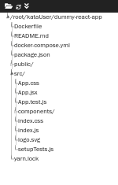
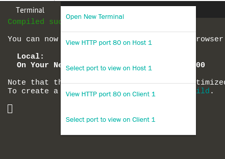

Well done - Let’s get started!
# Setup React project with Jest
We have created a dummy project that you will use throughout this tutorial. It is covering a basic log-in flow, and you will be responsible for writing tests for it. The first thing we need to do is install the necessary packages needed.
1. By default you are in the ‘root’ directory. We have created a dummy project for you to work on within this tutorial. It is a react project describing a login flow. To redirect to the dummy project, type:
`cd kataUser/dummy-react-app/src/`{{execute}}
`ls`{{execute}}
4. To be able to run the react project we need to install npm and its necessary packages.
`npm install`{{execute}}
5. This may take a while... in the meantime, let's check out the file structure! Our dummy project looks currently like this:
 1. App.jsx `/root/react-dummy/dummy-react-app/src/App.jsx`{{open}} Is the basic log in form.
 2. #TODO
6. When the npm installation is done, let's see how it looks like in production! To see it on your localhost type `npm start`{{execute}} and the website will be hosted on port 3000.
7. To open port 3000 in Katacoda:
1. Click on the “+” next to your terminal.
2. Click on “select port to view host 1”
3. A new tab opens in your browser
4. Type “3000” as the port number
5. Click “Display Port” and - Voilà!
8. Now, let's explore the dummy project even more.
   1. Open file.js (# TODO create a js-file containing react components that are commented and well structured)
   2. Walk through the code to ensure you know what it does. How can this code be tested?
   3. Seriously - think about it for a while
   4. Are you thinking? Yes? Good! :)
   5. Well, in the code you see some react components. React components are testable with component tests and this is where Jest comes in.
   6. Ikr! Jest?! Finally!!
 
Let's continue to dive deeper into the Jest testing framework in the next step!

