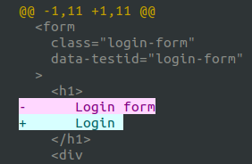
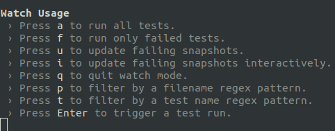

# Snapshot testing

Snapshot tests work a bit differently than classic assertion-based tests. Instead of having us defining what the expected behavior of a test should be, Jest does it for us. Or kinda. The first time a Snapshot test runs, Jest stores the Dom-tree returning from the test in a file and uses it as the assertion value for future test's runs.
 
## When to use Snapshot tests

Since it is so fast and easy to use Snapshot tests, it is a great asset to use when monitoring changes in the UI and ensure that unwanted changes aren't unwillingly introduced. The Snapshot file is effortless to update and Jest prints a diff each time a test doesn't pass which makes it great for testing UI components (and let's be honest, they tend to change in style a bit too often)

## The component to test

In the src folder, we have created another folder for you that is called `components`. `cd ~/kataUser/dummy-react-app/src/components/`{{execute}} In it, there is a file called `loginForm.jsx`- Open it and look at the code. 

The code renders the react components used to create the Login form and is called from `app.jsx`. If you want to view the login form again:

`npm start`{{execute}}

[Open your localhost](https://[[HOST_SUBDOMAIN]]-3000-[[KATACODA_HOST]].environments.katacoda.com/)

## Write the Snapshot test

In the `component` folder there is a test file for the loginForm called `loginForm.test.jsx`. In the file, you currently see some imports. Snapshot tests use a `renderer` to generate a value for the react tree (instead of a UI component like a normal assertion-test would do). 

Let's write our first snapshot test that checks that the login form renders correctly when the user is not logged in. In `src/components/loginForm.test.jsx` type:
 
<pre class="file"  data-filename= "/root/kataUser/dummy-react-app/src/components/loginForm.test.jsx" data-target="append">
test("loginform renders correctly when the user is not logged in", () => {
  const tree = render(&lt;LoginForm /&gt;)
  expect(tree).toMatchSnapshot();
});
</pre>

## Run the test

To run the test type `npm test`{{execute}}.

Hopefully, everything went smooth and your console will say `PASS  src/components/loginForm.test.jsx`

Open open `loginForm.test.jsx.snap` in `src/components/__snapshots__/`. As you can see the snap-file looks like the DOM tree of our login component. 

## Update the component

Now, let's update the component and watch our snapshot test fail! There are two main reasons for a test to fail:
   - There is an unexpected change in the component that needs to be addressed (a bug!)
   - The snapshot file is outdated and needs to be updated

In `src/components/loginForm.jsx` on row 40, change the title from `Login form` to just `Login`.

Do a `npm test`{{execute}} again. Now our snapshot test will fail. As you can see Jest gives us a diff-log so we can tell exactly what difference between our code and the snap-test. 

## Update the test

We think the extra "form" in the title is unnecessary, so let's update the snapshot to match our current code instead. At the end of the terminal message, you see some ways to move forward.  As you can see, updating the snapshot test is as simple as `u`{{execute}}. And BOOM - the test passed! 

You can also directly update your tests after updating your components by typing `npm test -- --updateSnapshot`{{execute}} in the terminal. 
