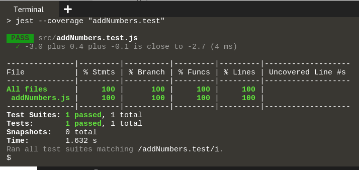

You're doing great! The last thing we will do in this tutorial is to learn a bit more about code coverage.
# Code Coverage
Code coverage is a measure of how much of your written code is covered by automated tests. The reason is to help you analyze the state, safe zones, and flaky areas, of your project code. 
To check the Code Coverage of our written Jest tests we have added a code coverage command in our scripts in the `package.json`file:  

What `CI=true npm test -- --coverage` means is:
* `CI=true` disables "watch mode" which is good when running tests in a test-pipeline or when you only want to run the tests once. 
* `--coverage` enables code coverage.

To check the code coverage of the written test in this tutorial, run `npm run test:coverage`{{execute}} in the terminal. 

It may seem like the Wizard of Oz, but the code coverage flag just simply checks the percentage of statements of your code body that have been executed through the test run and how many statements have not.

There are different measurements of coverage. You can either measure what lines of code are executed, or you can measure what "branches" are tested. A branch is one of the two paths your program can take when encountering an if-statement. We cannot say what metric you should be following, but both methods work as a benchmark for code coverage. 

You will probably encounter a lot of discussions about "what is a good test coverage ratio?" and like the agile world, it all depends on who you are and what you are building. Even though Google says 70-80% is good, you should always aim for 100%. Yes, we believe that everything is testable. If you follow TDD you will automatically reach a higher percentage. The takeaway we want you to remember is however quite simple: `"Each Sprint, the coverage should not go down."`

# Using docker as a test-runner

If you want to run the tests in a docker-container, you can do that just by going to the project folder and running `docker-compose run test`{{execute}}. If you are interested to see how it works, you can read:

1. `docker-compose.yml`
2. The `Dockerfile`

This is a bit off-topic, so we will not go further into it in this tutorial, but if you are interested you can read more into how these files work on your own. 

# That's it!
Now you can write Jest-test for your React projects.
Happy testing, and remember to update your resume with your new smoking hot skill ;)
